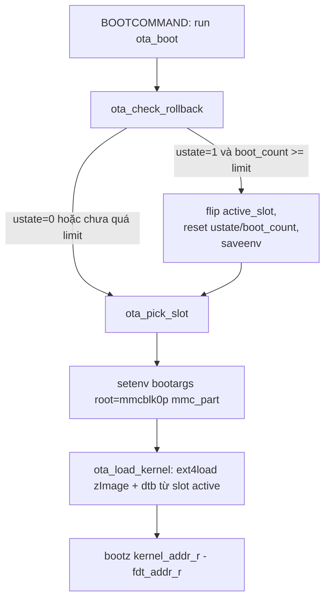

# A/B toàn slot (kernel + dtb + rootfs) qua `ext4load`, bỏ FAT `/boot`

**Ngày:** 2026-05-20
**Loại:** Thay đổi kiến trúc OTA — đảo ngược quyết định "kernel shared, không A/B" trước đó.
**Decision doc:** [decisions/01-rootfs-only-vs-full-ab.md](../decisions/01-rootfs-only-vs-full-ab.md)

---

## 1. Mục tiêu

OTA phải update được cả kernel + devicetree (không chỉ rootfs), đồng thời giữ tính atomic của rollback. Layout cũ — kernel/dtb nằm chung trên một partition FAT `/boot` không A/B — không update kernel an toàn được vì hai lý do:

- Update kernel in-place: ghi đè `zImage` trực tiếp lên FAT `/boot`. Mất điện giữa lúc ghi = brick, vì FAT không có journal, file đang ghi dở không rollback được.
- Mismatch sau rollback: nếu rootfs rollback về bản A nhưng kernel trên FAT đã là bản mới, ta có rootfs cũ chạy với kernel mới → lệch ABI module, lệch devicetree binding, có thể gọi syscall mới mà userspace cũ không lường.

Mục tiêu sau khi đổi: **rollback về slot X nghĩa là mọi artifact boot (rootfs + kernel + dtb) đều là của slot X**, không còn bất kỳ artifact nào dùng chung giữa hai slot.

---

## 2. Thay đổi tóm tắt

| Thành phần | Trước | Sau |
|---|---|---|
| Partition layout | 4 partition: `/boot` FAT 16M + rootA + rootB + data | 3 partition: rootA + rootB + data |
| Kernel + dtb | `/boot/zImage` + `/boot/*.dtb` trên FAT chung | `/boot/zImage` + `/boot/*.dtb` nằm **trong mỗi rootfs slot** |
| Boot logic | `boot.cmd` → compile thành `boot.scr` → đặt trên FAT, U-Boot `source` file đó | Bake thẳng vào U-Boot binary qua patch C header (`CONFIG_EXTRA_ENV_SETTINGS`) |
| U-Boot load kernel | `load mmc 0:1 ...` (đọc từ FAT partition) | `ext4load mmc 0:${mmc_part} ...` (đọc từ rootfs slot active) |
| `mmc_part` mapping | A→2, B→3 | A→1, B→2 |
| `BOOTCOMMAND` | `run findfdt; run init_console; run finduuid; run envboot; run distro_bootcmd` | `run ota_boot` |

Hệ quả về số partition: rootA dịch `p2→p1`, rootB dịch `p3→p2`, data dịch `p4→p3`. Mọi chỗ hardcode số partition đều phải đồng bộ theo (chi tiết ở mục 4). Dung lượng tiết kiệm được: ~16MB (bỏ FAT `/boot`).

---

## 3. Vì sao chọn cách này (ngắn gọn)

Đã cân nhắc 3 phương án trong [decision doc](../decisions/01-rootfs-only-vs-full-ab.md):

- **A. Update kernel in-place trên FAT chung** — bị loại vì phá tính atomic + rủi ro brick cao.
- **B. Kernel/dtb nằm trong rootfs, U-Boot `ext4load` từ slot active** ← chọn.
- **C. Thêm 2 partition `bootA`/`bootB` FAT riêng** — bị loại vì phức tạp hơn B mà không lợi thêm.

Lý do chốt B: atomic per-slot là tự nhiên (kernel đi cùng rootfs trong một partition, ghi 1 lần atomic được cả cụm), layout đơn giản hơn (3 partition), và không còn file `boot.scr` rời cần đảm bảo luôn có mặt + đúng integrity — thay vào đó logic boot được compile thẳng vào U-Boot binary.

Trade-off chính đã chấp nhận: muốn sửa logic boot phải rebuild + reflash U-Boot raw (không OTA được phần logic này). Vì logic A/B gần như không bao giờ đổi nên chấp nhận được.

---

## 4. Chi tiết từng thay đổi trong source

### 4.1. Partition layout — `meta-ota/wic/bbb-ota.wks`

Bỏ hẳn dòng `part /boot` FAT. File sau khi đổi còn 3 partition rootfs/data, phần U-Boot raw (MLO + u-boot.img + u-boot-env.raw) vẫn rawcopy như cũ:

```wks
bootloader --ptable msdos

part --source rawcopy --ondisk mmcblk0 --no-table --align 128  --sourceparams="file=MLO"
part --source rawcopy --ondisk mmcblk0 --no-table --align 384  --sourceparams="file=u-boot.img"
part --source rawcopy --ondisk mmcblk0 --no-table --align 2432 --sourceparams="file=u-boot-env.raw"

part /     --source rootfs --ondisk mmcblk0 --fstype=ext4 --label rootA --align 4096 --fixed-size 160 --active --use-uuid
part       --source empty  --ondisk mmcblk0 --fstype=ext4 --label rootB --align 4096 --fixed-size 160 --use-uuid
part /data                 --ondisk mmcblk0 --fstype=ext4 --label data  --align 4096 --fixed-size 128 --use-uuid
```

Điểm cần chú ý:

- rootA giờ là partition đầu tiên có bảng (p1), rootB là p2, data là p3. Trước đây FAT `/boot` chiếm p1 nên ba partition này là p2/p3/p4.
- Ba dòng `rawcopy` không nằm trong partition table (`--no-table`), nên không ảnh hưởng cách đánh số p1/p2/p3.
- Vị trí env raw không đổi: offset `0x260000`–`0x280000` vẫn nằm **trước** partition đầu tiên (rootA bắt đầu ở `0x400000` do align 4096 KiB), nên việc bỏ FAT không đụng vào vùng env.

### 4.2. U-Boot — logic boot bake vào built-in env

**File mới: `meta-ota/recipes-bsp/u-boot/files/0001-add-ota-boot-env.patch`** (thay cho `0001-add-env-boot.patch` cũ).

Patch này thêm vào `CONFIG_EXTRA_ENV_SETTINGS` trong `include/configs/am335x_evm.h` — tức là các biến env được compile thẳng vào U-Boot binary, có sẵn ngay cả khi env raw trên MMC trống/hỏng. Nội dung thêm vào (đã bỏ phần escape `\` của C macro cho dễ đọc):

```sh
# --- Default state + paths ---
boot_limit=3
active_slot=A
boot_count=0
ustate=0
kernel_image=/boot/zImage
fdtfile=/boot/am335x-boneblack.dtb

# --- 1. Kiểm tra & xử lý rollback ---
ota_check_rollback=
    if test "${ustate}" = "1"; then
        if test ${boot_count} -ge ${boot_limit}; then
            echo OTA: boot_count >= boot_limit, rolling back;
            if test "${active_slot}" = "A"; then
                setenv active_slot B;
            else
                setenv active_slot A;
            fi;
            setenv ustate 0;
            setenv boot_count 0;
            saveenv;
        else
            setexpr boot_count ${boot_count} + 1;
            saveenv;
            echo OTA: upgrade boot attempt ${boot_count}/${boot_limit};
        fi;
    fi

# --- 2. Map slot (A/B) → số partition (1/2) ---
ota_pick_slot=
    if test "${active_slot}" = "A"; then
        setenv mmc_part 1;
    else
        setenv mmc_part 2;
    fi

# --- 3. Load kernel + dtb từ rootfs slot active ---
ota_load_kernel=
    echo OTA: loading kernel from slot ${active_slot} (mmcblk0p${mmc_part});
    ext4load mmc 0:${mmc_part} ${kernel_addr_r} ${kernel_image};
    ext4load mmc 0:${mmc_part} ${fdt_addr_r} ${fdtfile}

# --- 4. Orchestrator: gọi 3 cái trên rồi boot ---
ota_boot=
    run ota_check_rollback;
    run ota_pick_slot;
    setenv bootargs root=/dev/mmcblk0p${mmc_part} rw rootwait console=ttyO0,115200n8 panic=10;
    run ota_load_kernel;
    bootz ${kernel_addr_r} - ${fdt_addr_r}
```

Vai trò từng biến và lý do thiết kế:

- `ota_check_rollback` là trái tim của rollback tự động. Nó chỉ chạy khi `ustate=1` (nghĩa là vừa có OTA, đang ở chế độ "thử bản mới, chưa confirm"). Mỗi lần boot mà chưa confirm thì tăng `boot_count`. Khi `boot_count >= boot_limit` (3 lần fail), nó lật `active_slot` sang slot kia, reset state về sạch (`ustate=0`, `boot_count=0`) và `saveenv`. Nếu bản mới boot OK thì userspace sẽ set `ustate=0` (qua `ota-confirm-boot.service`) trước khi đạt `boot_limit`, nên nhánh rollback không bao giờ chạy.
- `ota_pick_slot` tách riêng việc map `active_slot` → `mmc_part` để các biến khác chỉ cần dùng `${mmc_part}`. Đây là chỗ duy nhất biết "A là partition nào". Mapping mới: **A→1, B→2** (trước là A→2, B→3 do còn FAT chiếm p1).
- `ota_load_kernel` dùng `ext4load` (không phải `load`/`fatload`) để đọc `zImage` và dtb trực tiếp từ filesystem ext4 của slot active. Đây là mấu chốt khiến kernel "đi theo slot": load từ `mmc 0:${mmc_part}` nghĩa là từ đúng rootfs đang được chọn.
- `ota_boot` ghép mọi thứ lại và set `bootargs` ngay tại đây: `root=/dev/mmcblk0p${mmc_part}` (rootfs khớp slot vừa chọn), `console=ttyO0,115200n8` (tự set, không cần `init_console` cũ), `panic=10` (kernel panic thì reboot sau 10s — điều kiện cần để cơ chế đếm `boot_count` có tác dụng khi bản mới panic lúc boot).

Sơ đồ luồng `run ota_boot`:



**`meta-ota/recipes-bsp/u-boot/files/0001-bbb-ota.cfg`** (defconfig fragment):

```ini
# Lưu ENV vào MMC raw (không qua filesystem)
CONFIG_ENV_IS_IN_MMC=y
CONFIG_SYS_MMC_ENV_DEV=0
CONFIG_SYS_MMC_ENV_PART=0
CONFIG_ENV_OFFSET=0x260000
CONFIG_ENV_SIZE=0x20000

# Enable setexpr command (ota_check_rollback cần để +1 boot_count)
CONFIG_CMD_SETEXPR=y

# ext4load để load kernel/dtb từ rootfs slot active.
# am335x_evm defconfig đã bật sẵn nhưng khai báo tường minh ở đây cho an toàn.
CONFIG_FS_EXT4=y
CONFIG_CMD_EXT4=y

CONFIG_BOOTDELAY=5
CONFIG_BOOTCOMMAND="run ota_boot"

# CONFIG_ENV_IS_NOWHERE is not set
# CONFIG_ENV_IS_IN_FAT is not set
```

Hai thay đổi đáng chú ý so với trước:

- `CONFIG_BOOTCOMMAND` rút gọn từ chain `findfdt → init_console → finduuid → envboot → distro_bootcmd` xuống chỉ `run ota_boot`. Lý do bỏ từng cái: bỏ `findfdt` vì ta tự `setenv fdtfile`; bỏ `init_console` vì ta tự đưa `console=` vào `bootargs`; bỏ `finduuid` vì `root=` giờ dùng `/dev/mmcblk0p${mmc_part}` thay vì UUID; bỏ `envboot`/`distro_bootcmd` vì không còn `boot.scr` để source.
- `CONFIG_CMD_SETEXPR=y` được thêm vì `ota_check_rollback` cần `setexpr` để tăng `boot_count`.

**`meta-ota/recipes-bsp/u-boot/files/u-boot-ota-env.txt`** — chỉ còn 4 dòng state mutable, không còn chứa path kernel/dtb:

```ini
boot_limit=3
active_slot=A
boot_count=0
ustate=0
```

Lý do tách: đây là phần state **thay đổi lúc runtime** (userspace `fw_setenv` và U-Boot `saveenv` ghi vào đây), nên phải nằm trong env raw trên MMC. Còn `kernel_image`/`fdtfile`/logic boot là **bất biến**, để trong default env compile-in (mục patch ở trên) sạch hơn — flash lại env raw không làm mất logic boot.

**`meta-ota/recipes-bsp/u-boot/u-boot_%.bbappend`** — recipe build U-Boot:

```python
FILESEXTRAPATHS:prepend := "${THISDIR}/files:"

SRC_URI:append = " \
    file://u-boot-ota-env.txt \
    file://0001-bbb-ota.cfg \
    file://0001-add-ota-boot-env.patch \
"

# u-boot-tools-native cung cấp mkenvimage để build u-boot-env.raw
DEPENDS:append = " u-boot-tools-native"

do_compile:append() {
    cat ${WORKDIR}/u-boot-ota-env.txt >> ${B}/u-boot-initial-env
    mkenvimage -s 0x20000 -o ${B}/u-boot-env.raw ${B}/u-boot-initial-env
}

do_install:append() {
    install -d ${D}${sysconfdir}
    install -m 0644 ${B}/u-boot-initial-env ${D}${sysconfdir}/u-boot-initial-env
}

do_deploy:append() {
    install -m 0644 ${B}/u-boot-env.raw ${DEPLOYDIR}/u-boot-env.raw
}
```

So với recipe cũ: trong `SRC_URI` đổi `0001-add-env-boot.patch` → `0001-add-ota-boot-env.patch` và **bỏ `file://boot.cmd`**; trong `do_compile` **bỏ step `mkimage -A arm -T script -O linux -C none -d boot.cmd boot.scr`** và bỏ deploy `boot.scr` ra `DEPLOYDIR`. Phần build `u-boot-env.raw` từ `u-boot-ota-env.txt` (qua `mkenvimage`) giữ nguyên — vẫn pre-flash env raw vào MMC offset `0x260000`.

**Hai file bị xóa:**

- `meta-ota/recipes-bsp/u-boot/files/boot.cmd` — toàn bộ logic đã chuyển vào built-in env.
- `meta-ota/recipes-bsp/u-boot/files/0001-add-env-boot.patch` — patch cũ định nghĩa `envboot`/`loadbootscript`/`bootscript` để source `boot.scr`, không còn cần.

### 4.3. SWUpdate — đồng bộ số partition

**`meta-ota/recipes-extended/images/beaglebone/sw-description.in`** — đổi device đích của 2 install set xuống một bậc:

```diff
 stable: {
     copy1: {
         images: (
             {
                 filename = "@IMAGE_NAME@";
-                device   = "/dev/mmcblk0p2";   # rootA cũ
+                device   = "/dev/mmcblk0p1";   # rootA mới
                 type     = "raw";
                 compressed = "zlib";
             }
         );
         ...
     };
     copy2: {
         images: (
             {
                 filename = "@IMAGE_NAME@";
-                device   = "/dev/mmcblk0p3";   # rootB cũ
+                device   = "/dev/mmcblk0p2";   # rootB mới
                 ...
```

**`meta-ota/recipes-support/swupdate/files/09-swupdate-args`** — script chọn install set theo slot đang chạy, đổi điều kiện check:

```sh
# Chọn install set theo slot đang chạy:
#   đang chạy rootA (mmcblk0p1) → flash vào copy2 (mmcblk0p2 = rootB)
#   đang chạy rootB (mmcblk0p2) → flash vào copy1 (mmcblk0p1 = rootA)
rootfs=$(swupdate -g)

if [ "$rootfs" = '/dev/mmcblk0p1' ]; then   # trước: '/dev/mmcblk0p2'
    selection="-e stable,copy2"
else
    selection="-e stable,copy1"
fi

SWUPDATE_ARGS="-H @BOARD_NAME@:@HW_REVISION@ ${selection} -f /etc/swupdate.cfg"
SWUPDATE_WEBSERVER_ARGS="-document_root /www -port 8080"
```

Logic không đổi về bản chất: đang chạy slot active thì luôn cài bản mới vào slot đối nghịch. Chỉ là "slot active" giờ là `p1` thay vì `p2`.

**`switch-slot.sh`** — **không đổi**. Script này chỉ thao tác biến `active_slot` qua `fw_setenv` (`A`/`B`), không hardcode số partition, nên việc dịch partition không ảnh hưởng.

### 4.4. Image — `meta-ota/recipes-core/images/core-image-home-gateway.bbappend`

Trước đây file này có `IMAGE_BOOT_FILES = "zImage am335x-boneblack.dtb ..."` để wic copy kernel/dtb vào FAT `/boot`. Sau khi bỏ FAT, **xóa hoàn toàn `IMAGE_BOOT_FILES`**. File hiện tại:

```python
require conf/ota-version.inc

# OTA runtime packages.
IMAGE_INSTALL:append = " \
    swupdate             \
    swupdate-www         \
    libubootenv-bin      \
    ota-confirm-boot     \
"

WKS_FILE = "bbb-ota.wks"
IMAGE_FSTYPES = " wic wic.bmap ext4.gz"

do_image_wic[depends] += "virtual/bootloader:do_deploy"

# /etc/hwrevision — sw-description dùng để check hardware compatibility
# /etc/sw-version — SWUpdate dùng để so sánh version khi có rule no-downgrade
write_ota_metadata() {
    install -d ${IMAGE_ROOTFS}${sysconfdir}
    echo "${OTA_BOARD_NAME} ${OTA_HW_REVISION}" > ${IMAGE_ROOTFS}${sysconfdir}/hwrevision
    echo "${OTA_SW_VERSION}"         > ${IMAGE_ROOTFS}${sysconfdir}/sw-versions
}

ROOTFS_POSTPROCESS_COMMAND += "write_ota_metadata; "
```

Vì sao không cần `IMAGE_BOOT_FILES` nữa: `zImage` và `am335x-boneblack.dtb` được Yocto cài vào rootfs `/boot/` theo mặc định qua package `kernel-image` + `kernel-devicetree` (đã kéo sẵn trong `core-image-base`). Còn U-Boot raw artifacts (`MLO`, `u-boot.img`, `u-boot-env.raw`) được wic rawcopy theo `bbb-ota.wks`, cũng không đi qua `IMAGE_BOOT_FILES`.

### 4.5. Docs đi kèm

- `docs/concepts/01-ota-ab-architecture.md` — cập nhật tổng dung lượng (~448MB thay vì ~464MB), ASCII layout bỏ p1 FAT, cột "U-Boot boot.scr" → "U-Boot built-in env", mapping `copy1→p1`/`copy2→p2`, rewrite mục bootscript thành built-in env với bảng 4 biến `ota_*`, đổi `mmc_part = 1/2`.
- `docs/decisions/01-rootfs-only-vs-full-ab.md` (file mới) — full trade-off của quyết định này.
- `CLAUDE.md` — cập nhật bullet trong "Quyết định kiến trúc đã chốt".

---

## 5. Cần làm sau khi merge

1. **Build và flash lại từ đầu** — partition layout đổi nên không thể OTA từ image cũ sang image mới. Quy trình: build `core-image-home-gateway`, flash bằng `wic` thông thường (xem [guides/01-build-and-flash.md](../guides/01-build-and-flash.md)).
2. **Verify boot lần đầu**: U-Boot console log phải thấy `OTA: loading kernel from slot A (mmcblk0p1)` và board boot tới multi-user.
3. **Chạy chu trình OTA test** — upload `.swu` mới qua webserver port 8080, board reboot, verify `fw_printenv ustate` chuyển từ `1` → `0` sau khi `ota-confirm-boot.service` chạy.
4. **Test rollback (nhánh boot_limit)**: cố tình tạo bản kernel panic lúc boot → upload `.swu` → sau 3 lần thử board phải tự lật về slot cũ (log `OTA: boot_count >= boot_limit, rolling back`).

---

## 6. Risks đã ý thức

- **`/data` partition dịch p4→p3**: nếu có tool ngoài codebase (provisioning, factory tool) hardcode `/dev/mmcblk0p4` để mount `/data` thì sẽ vỡ. Trong repo không có hardcode này (wks dùng `--label data` + `--use-uuid`), nhưng tooling bên ngoài cần verify.
- **Recovery khi env raw corrupt**: default env compile-in luôn đặt `active_slot=A`. Nếu slot A cũng hỏng, board không boot được — chưa có rescue partition. Trade-off đã chấp nhận từ thiết kế gốc (xem section 5.8 concept doc).
- **Logic boot bake vào U-Boot binary**: sửa logic boot = rebuild + reflash MLO/u-boot.img qua SD, không OTA được. Trade-off đã chấp nhận trong decision doc.
