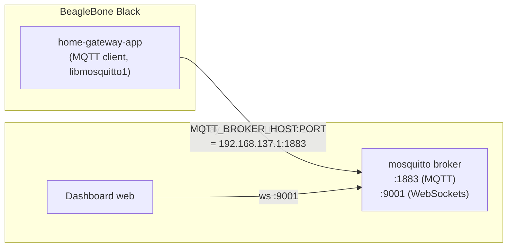

# Chuyển MQTT broker từ BBB sang máy host

**Ngày:** 2026-05-21
**Loại:** Thay đổi kiến trúc kết nối — broker không còn chạy on-device.
**Guide vận hành:** [guides/04-mqtt-broker-tren-host.md](../guides/04-mqtt-broker-tren-host.md)

---

## 1. Mục tiêu

Trước đây mosquitto broker chạy ngay trên BBB và app `home-gateway-app` kết nối tới `127.0.0.1:1883`. Chuyển broker ra máy host (PC dev = gateway của subnet, `192.168.137.1`) để:

- Giảm tải + giảm rootfs trên BBB (board chỉ còn là MQTT client).
- Dễ quan sát/monitor message MQTT từ PC, tích hợp với dashboard web (WebSockets 9001) chạy trên host.
- Tách vòng đời của broker khỏi vòng đời OTA của board.

BBB giữ vai trò client: vẫn cần `libmosquitto1` (runtime lib) để app link và kết nối tới broker.

Sơ đồ kết nối sau thay đổi:



---

## 2. Thay đổi tóm tắt

| Thành phần | Trước | Sau |
|---|---|---|
| Broker mosquitto | Chạy trên BBB (systemd auto-enable) | Chạy trên host `192.168.137.1` |
| Gói trên image BBB | `mosquitto` + `libmosquitto1` + `mosquitto-clients` | Chỉ `libmosquitto1` (client lib). `mosquitto-clients` chuyển sang `DEV_PACKAGES` (chỉ development build) |
| App connect tới đâu | hardcode `127.0.0.1:1883` | đọc env `MQTT_BROKER_HOST` / `MQTT_BROKER_PORT`, fallback `127.0.0.1:1883` |
| Địa chỉ broker khai báo ở đâu | — | qua `Environment=` trong `home-dashboard.service` (`192.168.137.1:1883`) |
| Config broker | recipe on-device cài `mosquitto.conf` | cài thủ công trên host (xem guide) |

---

## 3. Chi tiết từng thay đổi trong source

Thay đổi nằm ở **hai repo**: repo Yocto (`meta-smartfarm`) và repo app (`smart-home-dashboard`).

### 3.1. Yocto — `meta-bsp/recipes-core/images/core-image-home-gateway.bb`

Tách mosquitto thành 2 nhóm: bỏ broker daemon khỏi image production, chỉ giữ client lib; còn `mosquitto-clients` (tool debug) chuyển sang nhóm chỉ có khi build development. Đoạn liên quan sau khi đổi:

```python
# =============================================
# APPLICATION PACKAGES
# =============================================
IMAGE_INSTALL:append = " \
    openssh openssh-sshd \
    libmosquitto1 \
    libgpiod-tools libgpiod \
    ttf-dejavu-sans fontconfig \
    qtbase \
    home-dashboard bbb-static-ip \
"

# DEV PACKAGES - chỉ vào image khi DEVELOPMENT_BUILD = "1"
DEV_PACKAGES = " \
    i2c-tools \
    evtest \
    systemd-analyze \
    tslib tslib-calibrate tslib-tests \
    mosquitto-clients \
"

DEVELOPMENT_BUILD ?= "0"
IMAGE_INSTALL:append = "${@'${DEV_PACKAGES}' if d.getVar('DEVELOPMENT_BUILD') == '1' else ''}"
```

Giải thích:

- `IMAGE_INSTALL` **bỏ `mosquitto`** (gói broker daemon) và **bỏ `mosquitto-clients`** khỏi danh sách luôn-cài. Giữ lại `libmosquitto1` vì app vẫn cần lib này để mở kết nối MQTT tới broker host.
- `mosquitto-clients` được đưa vào `DEV_PACKAGES` — đây là tool `mosquitto_pub`/`mosquitto_sub` để debug ngay trên BBB, chỉ cần khi `DEVELOPMENT_BUILD = "1"`. Image production (`DEVELOPMENT_BUILD = "0"`) sẽ không có.

### 3.2. Yocto — `meta-bsp/recipes-qtapp/home-dashboard/files/home-dashboard.service`

Thêm 2 dòng `Environment=` để truyền địa chỉ broker vào app lúc chạy. Đổi broker chỉ cần sửa file unit này, **không phải rebuild app**:

```ini
[Service]
Type=simple
Environment=TSLIB_TSDEVICE=/dev/input/event0
Environment=TSLIB_CONFFILE=/etc/ts.conf
Environment=TSLIB_CALIBFILE=/etc/pointercal
Environment=TSLIB_FBDEVICE=/dev/fb0
# MQTT broker chạy trên máy host (gateway của subnet 192.168.137.0/24)
Environment=MQTT_BROKER_HOST=192.168.137.1
Environment=MQTT_BROKER_PORT=1883
ExecStart=/usr/bin/home-gateway-app -platform linuxfb -plugin=tslib
Restart=on-failure
RestartSec=2
```

### 3.3. App — `smart-home-dashboard`, file `src/ui/MainDashboard.cpp` (`Widget::init()`)

Đây là thay đổi nằm ở **repo riêng** ([github.com/Leminuos/smart-home-dashboard](https://github.com/Leminuos/smart-home-dashboard)), không trong repo Yocto. Thay lời gọi connect hardcode bằng đọc env lúc runtime:

```cpp
// Trước:
// client.connectToHost("127.0.0.1", 1883, 60);

// Sau:
const QString brokerHost = qEnvironmentVariable("MQTT_BROKER_HOST", QStringLiteral("127.0.0.1"));
bool portOk = false;
int brokerPort = qEnvironmentVariableIntValue("MQTT_BROKER_PORT", &portOk);
if (!portOk || brokerPort <= 0)
    brokerPort = 1883;
client.connectToHost(brokerHost, brokerPort, 60);
```

Giải thích:

- `qEnvironmentVariable("MQTT_BROKER_HOST", "127.0.0.1")` đọc host từ env, fallback `127.0.0.1` nếu env không set → giữ nguyên hành vi cũ khi chạy mà không có env (ví dụ chạy tay lúc debug).
- `qEnvironmentVariableIntValue(..., &portOk)` parse port; nếu env trống hoặc không phải số hợp lệ (`portOk == false`) hoặc `<= 0` thì rơi về `1883`.
- Cặp env này khớp đúng tên với 2 dòng `Environment=` trong `home-dashboard.service` ở mục 3.2 — đó là cách service truyền địa chỉ broker xuống app.

### 3.4. Hai file bị xóa (recipe broker on-device)

- `meta-bsp/recipes-connectivity/mosquitto/mosquitto_%.bbappend` — bbappend này trước đây cài `mosquitto.conf` và auto-enable `mosquitto.service` để chạy broker trên board; không còn dùng.
- `meta-bsp/recipes-connectivity/mosquitto/files/mosquitto.conf` — config broker; nội dung đã chuyển vào [guide cài broker trên host](../guides/04-mqtt-broker-tren-host.md) (mục 2).

### 3.5. Có một thứ **không đổi** (và lý do)

`meta-bsp/conf/distro/home-gateway.conf` vẫn giữ `mosquitto-dev` trong `TOOLCHAIN_TARGET_TASK`. Lý do: SDK build app out-of-tree vẫn cần header `mosquitto.h` để compile. App in-tree (recipe `home-dashboard` có `DEPENDS = "mosquitto"`) cũng lấy lib + header từ sysroot bình thường. Bỏ broker daemon khỏi image không ảnh hưởng tới việc compile app — đó là 2 chuyện khác nhau (runtime image vs. build-time sysroot/SDK).

---

## 4. Cần làm sau khi merge

1. **Cài + chạy broker trên host** theo [guides/04-mqtt-broker-tren-host.md](../guides/04-mqtt-broker-tren-host.md). Đảm bảo broker listen `0.0.0.0:1883` (mosquitto 2.x mặc định chỉ localhost) và firewall mở cho subnet `192.168.137.0/24`.
2. **Commit + push app**: thay đổi `MainDashboard.cpp` nằm ở repo riêng. Commit (chỉ file này, tách khỏi WIP khác đang dở trên local) và push lên GitHub.
3. **Bump `SRCREV`** trong `home-dashboard_1.0.bb` sang commit hash mới — nếu không, Yocto vẫn fetch bản cũ không có logic đọc env.
4. **Rebuild image**: `MACHINE=bbb-home-gateway DISTRO=home-gateway bitbake core-image-home-gateway`, flash lại (hoặc OTA nếu chỉ đổi rootfs hợp lệ).
5. **Verify**: trên BBB `journalctl -u home-dashboard -f` thấy `Connected to MQTT broker`; trên host `mosquitto_sub -h 192.168.137.1 -t 'sensor/#' -v` thấy data.

---

## 5. Risks đã ý thức

- **Phụ thuộc mạng + host**: BBB mất hết chức năng MQTT nếu host tắt hoặc mất link. App có sẵn auto-reconnect (`mosquitto_reconnect_delay_set` 2–30s) nên không crash, nhưng không có broker dự phòng on-device.
- **`allow_anonymous true`**: broker host không auth — chỉ chấp nhận trong lab/internal. Production cần bật user/pass hoặc TLS (cùng tinh thần [decisions/04-no-image-signing.md](../decisions/04-no-image-signing.md)).
- **IP host đổi**: nếu host không còn là `192.168.137.1`, phải sửa `Environment=MQTT_BROKER_HOST` trong service. Không hardcode trong binary nên không rebuild app, nhưng cần sửa unit file trên board (hoặc rebuild image).
- **Quên bump `SRCREV`** (bước 4.3): image build ra vẫn dùng bản app cũ hardcode `127.0.0.1` → app trên BBB không kết nối được broker host.
