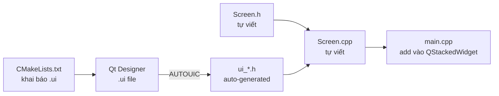
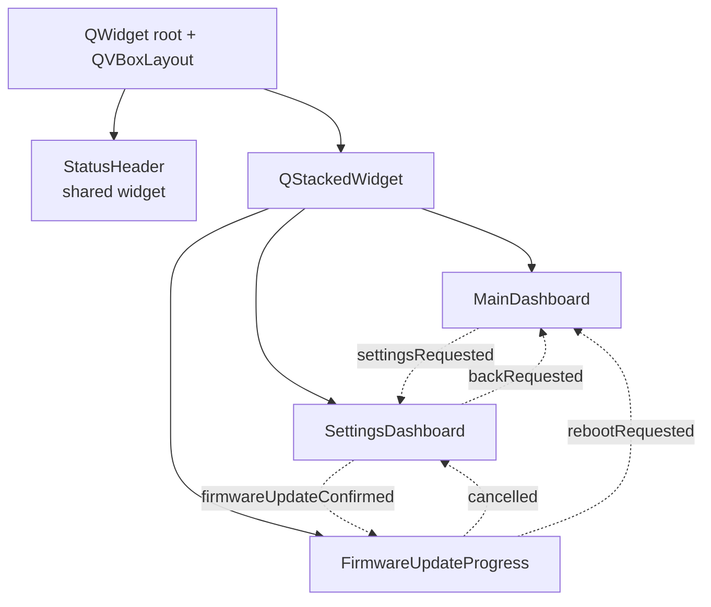

# Các bước tạo một Screen với Qt Widgets + Qt Designer

> **Screen** ở đây hiểu là một màn hình (page) trong ứng dụng — ví dụ `MainDashboard`, `SettingsDashboard`, `FirmwareUpdateProgress`. Mỗi screen là một class kế thừa `QWidget`, được thiết kế bằng Qt Designer (`.ui`) và hiển thị bên trong một `QStackedWidget` để chuyển qua lại.

---

## 1. Tổng quan luồng tạo screen



3 file luôn đi cùng nhau cho mỗi screen:

| File             | Vai trò                                                        |
| ---------------- | -------------------------------------------------------------- |
| `MyScreen.ui`    | Khai báo layout, widget con bằng XML (mở bằng Qt Designer).    |
| `MyScreen.h`     | Khai báo class `MyScreen : public QWidget`, signals, slots.    |
| `MyScreen.cpp`   | Logic: connect signal, xử lý event, gọi `ui->setupUi(this)`.   |
| `ui_MyScreen.h`  | **Tự sinh** từ `.ui` bởi `uic` (qua `CMAKE_AUTOUIC`).          |

---

## 2. Các bước cụ thể

### Bước 1 — Tạo file `.ui` bằng Qt Designer

1. Mở Qt Creator -> File -> New File or Project... -> Qt -> Qt Designer Form -> Choose
2. Hộp thoại Qt Designer Form xuất hiện, chọn template **Widget** vì mỗi screen là một `QWidget` độc lập.
3. Đặt tên file và lưu file `.ui` tại `src/ui/` (tên file nên trùng với tên class)
3. Tại **Property Editor** tìm `objectName` để đặt tên class (vd `MyScreen`) — tên này sẽ là class XML root, phải khớp với tên C++ class.
3. Kéo thả widget từ **Widget Box** vào canvas, bố trí bằng layout (`QVBoxLayout`, `QHBoxLayout`, `QGridLayout`) — **luôn dùng layout**, không bao giờ đặt widget bằng toạ độ tuyệt đối.
4. Đặt `objectName` cho mọi widget cần truy cập từ C++ (vd `tempLabel`, `okButton`).
5. Lưu vào `src/ui/MyScreen.ui`.

> 📌 Quy ước trong dự án: file `.ui` đặt ở `src/ui/`. Tên class trong `.ui` phải trùng tên class C++.

### Bước 2 — Viết header `MyScreen.h`

```cpp
#ifndef MYSCREEN_H
#define MYSCREEN_H

#include <QWidget>

QT_BEGIN_NAMESPACE
namespace Ui { class MyScreen; }   // forward-declare class do uic sinh
QT_END_NAMESPACE

class MyScreen : public QWidget
{
    Q_OBJECT
public:
    explicit MyScreen(QWidget *parent = nullptr);
    ~MyScreen();

signals:
    void backRequested();           // signal phát ra khi user nhấn Back

private:
    Ui::MyScreen *ui;               // con trỏ tới UI auto-generated
};

#endif
```

> Forward declaration là cách nói với compiler: "Class này tồn tại, nhưng tao chưa cần biết chi tiết nó ngay bây giờ."

### Bước 3 — Viết implementation `MyScreen.cpp`

```cpp
#include "MyScreen.h"
#include "./ui_MyScreen.h"          // header sinh từ .ui

MyScreen::MyScreen(QWidget *parent)
    : QWidget(parent), ui(new Ui::MyScreen)
{
    ui->setupUi(this);              // dựng cây widget từ .ui

    connect(ui->backButton, &QPushButton::clicked,
            this, &MyScreen::backRequested);
}

MyScreen::~MyScreen() { delete ui; }
```

**Quy tắc bắt buộc:**
- Luôn gọi `ui->setupUi(this)` đầu tiên trong constructor.
- Luôn `delete ui` trong destructor.
- Truy cập widget con qua `ui->objectName`.

### Bước 4 — Khai báo trong `CMakeLists.txt`

```cmake
set(CMAKE_AUTOUIC ON)               # bật auto-uic
set(CMAKE_AUTOMOC ON)               # cho Q_OBJECT
set(CMAKE_AUTOUIC_SEARCH_PATHS ${CMAKE_SOURCE_DIR}/src/ui)

set(UI_FILES
  ${CMAKE_SOURCE_DIR}/src/ui/MyScreen.ui      # ← thêm file mới
  ...
)
```

> Nếu dùng `file(GLOB_RECURSE ...)` cho `.cpp`/`.h` thì `MyScreen.cpp/h` được tự gom; chỉ cần thêm thủ công file `.ui`.

### Bước 5 — Đăng ký vào `QStackedWidget` trong `main.cpp`

```cpp
MyScreen *myScreen = new MyScreen(stack);
const int myIndex = stack->addWidget(myScreen);

// Điều hướng đến screen
QObject::connect(otherScreen, &OtherScreen::openMyScreen, [&]() {
    stack->setCurrentIndex(myIndex);
});

// Quay về từ screen này
QObject::connect(myScreen, &MyScreen::backRequested, [&]() {
    stack->setCurrentIndex(prevIndex);
});
```

---

## 3. Mô hình điều hướng giữa các screen



Mỗi screen **không tự chuyển trang** — nó chỉ phát signal, `main.cpp` (chủ của `QStackedWidget`) lắng nghe và gọi `setCurrentIndex()`. Đây là pattern quan trọng giúp screen không bị coupling với nhau.

---

## 4. Checklist nhanh khi thêm 1 screen mới

- [ ] Tạo `MyScreen.ui` trong `src/ui/`, đặt `<class>` trùng tên C++.
- [ ] Tạo `MyScreen.h` với forward-declare `namespace Ui { class MyScreen; }`.
- [ ] Tạo `MyScreen.cpp` gọi `ui->setupUi(this)` và `delete ui`.
- [ ] Thêm đường dẫn `.ui` vào `UI_FILES` trong `CMakeLists.txt`.
- [ ] Khai báo signals cho điều hướng (`backRequested`, `xxxRequested`).
- [ ] `addWidget()` vào `QStackedWidget` trong `main.cpp`.
- [ ] Connect signal điều hướng tới `stack->setCurrentIndex(...)`.
- [ ] Build → kiểm tra `ui_MyScreen.h` có sinh ra trong thư mục `build/`.
