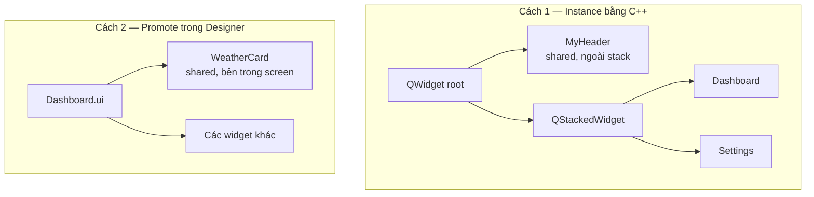
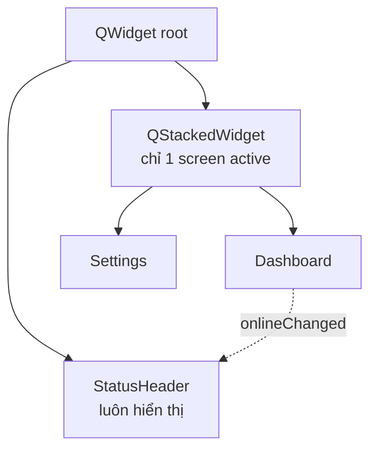
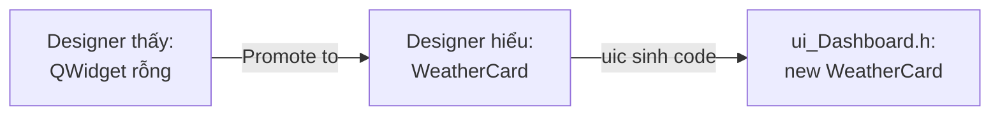
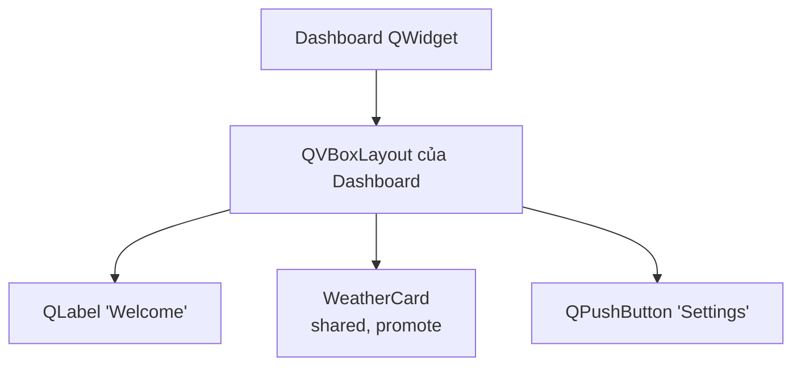
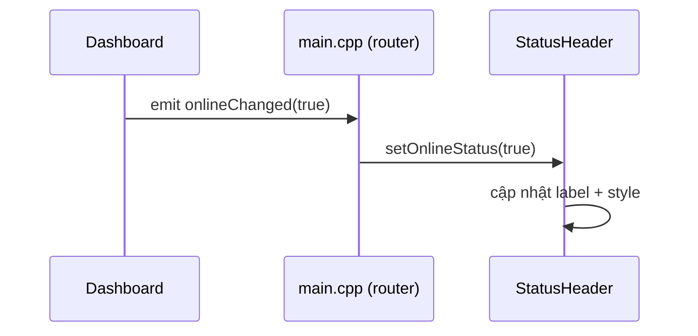

# Các bước tạo một Shared Widget dùng chung giữa các Screen

> **Shared widget** là một thành phần UI có thể tái sử dụng ở nhiều screen — ví dụ `StatusHeader` (hiển thị online/offline) hay `FirmwareUpdatePopup`. Về bản chất nó cũng là một class kế thừa `QWidget` có file `.ui` riêng, nhưng cách *sử dụng* khác screen ở chỗ nó được **nhúng vào** screen khác chứ không nằm trong `QStackedWidget`.

---

## 1. Có 2 cách dùng shared widget

Trước khi đi vào chi tiết, cần phân biệt **vị trí** mà shared widget xuất hiện trong cây UI:



| Tiêu chí                | Cách 1 — `new` trong C++                                | Cách 2 — Promote trong Designer                          |
| ----------------------- | ------------------------------------------------------- | -------------------------------------------------------- |
| **Vị trí trong cây UI** | Cùng cấp / ngoài screen (vd cạnh `QStackedWidget`).     | Bên trong layout của một screen cụ thể.                  |
| **Khai báo ở đâu**      | Code C++ (thường là `main.cpp`).                        | File `.ui` của screen cha (tag `<customwidgets>`).       |
| **Truy cập runtime**    | Qua biến C++ (`statusHeader->...`).                     | Qua `ui->weatherCard->...` của screen cha.               |
| **Use case điển hình**  | Header / footer / popup **toàn cục**, mọi screen dùng.  | Card / panel **dùng lại** trong vài screen riêng lẻ.     |
| **Ví dụ trong dự án**   | `StatusHeader` (đặt ngoài stack ở `main.cpp`).          | (Chưa có — sẽ minh hoạ bằng `WeatherCard` giả định.)     |

> 🧭 **Cách quyết định nhanh:** Hỏi "widget này có cần hiển thị **đồng thời** với mọi screen không?"
> - **Có** → Cách 1 (đặt ngoài stack, code lắp ráp ở `main.cpp`).
> - **Không, chỉ xuất hiện trong vài screen** → Cách 2 (Promote trong Designer của từng screen).

---

## 2. Viết shared widget

Giống hệt một screen (`.ui` + `.h` + `.cpp`), chỉ khác về *ý đồ sử dụng*. Tham khảo `src/ui/StatusHeader.{ui,h,cpp}` của dự án.

```cpp
// MyHeader.h
class MyHeader : public QWidget {
    Q_OBJECT
public:
    explicit MyHeader(QWidget *parent = nullptr);
    ~MyHeader();
    void setOnlineStatus(bool online);     // public API cho screen gọi vào
private:
    Ui::MyHeader *ui;
};
```

> 💡 Shared widget nên expose **public API** (setter/getter) và **signals** rõ ràng — đó chính là "interface" để screen tương tác với nó.

---

## 3. Cách 1 — Tạo trực tiếp bằng C++ (khuyến nghị cho widget toàn cục)

### 3.1 — Ý tưởng

Shared widget được tạo **bên ngoài** `QStackedWidget`, nằm cùng cấp với stack trong layout gốc. Vì nó không phải "trang" trong stack nên luôn hiển thị, bất kể screen nào đang active. Đây chính là cách [`StatusHeader`](../../home-gateway-app/src/ui/StatusHeader.h) đang được dùng trong dự án.

### 3.2 — Code mẫu (rút gọn từ [src/main.cpp](../../home-gateway-app/src/main.cpp))

```cpp
QWidget root;                                          // (1) container gốc của app
QVBoxLayout *rootLayout = new QVBoxLayout(&root);

StatusHeader *statusHeader = new StatusHeader(&root);  // (2) shared widget — tạo bằng new
rootLayout->addWidget(statusHeader);                   //     đặt LÊN TRÊN stack

QStackedWidget *stack = new QStackedWidget(&root);     // (3) stack chứa các screen
rootLayout->addWidget(stack, 1);                       //     stretch=1 để chiếm phần còn lại

Widget *dashboard = new Widget(stack);                 // (4) các screen
SettingsWidget *settings = new SettingsWidget(stack);
stack->addWidget(dashboard);
stack->addWidget(settings);

// (5) Cầu nối: screen phát signal → shared widget cập nhật
QObject::connect(dashboard, &Widget::onlineChanged,
                 statusHeader, &StatusHeader::setOnlineStatus);
```

Đọc theo số:
1. **`root`** là `QWidget` ngoài cùng — không thuộc về screen nào cả.
2. **`statusHeader`** được `new` riêng và `addWidget` vào `rootLayout`. Không nằm trong stack ⇒ luôn hiển thị.
3. **`stack`** chỉ chứa các "trang" có thể chuyển qua lại.
4. Mỗi screen được `new` rồi `addWidget` vào stack.
5. `main.cpp` đóng vai trò **router**: kết nối signal từ screen sang slot của shared widget.

### 3.3 — Cây widget runtime



### 3.4 — Quy tắc thiết kế

- ✅ **Screen không giữ con trỏ** tới shared widget — chỉ `emit` signal.
- ✅ **Shared widget không biết** screen nào đang gọi — chỉ expose slot/setter.
- ✅ **`main.cpp` là nơi duy nhất** biết cả hai và làm cầu nối.
- ❌ **Không** truyền `statusHeader` vào constructor của screen (sẽ tạo coupling không cần thiết).

---

## 4. Cách 2 — Promote widget trong Qt Designer (cho widget nội bộ một screen)

### 4.1 — Ý tưởng

Shared widget nằm **bên trong** layout của screen cha (vd cùng một `WeatherCard` xuất hiện trong Dashboard và Settings). Vì layout do Designer dựng sẵn, ta cần một cách để Designer "biết" tới class C++ tự viết — đó là cơ chế **Promote**: đặt một `QWidget` rỗng làm placeholder rồi nói cho Designer "thực ra đây là `WeatherCard`".



### 4.2 — Các bước trong Qt Designer

Mở file `.ui` của screen cha (vd `MainDashboard.ui`):

1. **Kéo placeholder**: Kéo một `QWidget` từ panel widget vào nơi muốn đặt shared widget.
2. **Promote**: Click chuột phải vào placeholder → **Promote to...**
3. **Khai báo class** trong dialog hiện ra:
   - **Promoted class name:** `WeatherCard`
   - **Header file:** `ui/WeatherCard.h`
   - Tick **Global include** nếu include path là project-relative (dùng `<>` thay vì `""`).
4. Bấm **Add** → **Promote**. Placeholder sẽ chuyển sang dùng class `WeatherCard`.
5. Đặt **objectName** cho placeholder (vd `weatherCard`) — đây là tên dùng để truy cập từ C++.

### 4.3 — File `.ui` sau khi promote

Designer sẽ tự thêm các tag sau vào XML:

```xml
<!-- Vị trí widget: dùng class custom thay vì QWidget -->
<widget class="WeatherCard" name="weatherCard"/>

<!-- Khai báo class custom ở cuối file -->
<customwidgets>
  <customwidget>
    <class>WeatherCard</class>
    <extends>QWidget</extends>
    <header>ui/WeatherCard.h</header>
  </customwidget>
</customwidgets>
```

Khi build, `uic` sẽ sinh ra code C++ tự động `#include "ui/WeatherCard.h"` và gọi `new WeatherCard(...)` — bạn không phải viết tay phần khởi tạo.

### 4.4 — Truy cập từ screen cha

Trong `.cpp` của screen cha, dùng con trỏ `ui->weatherCard` như mọi widget khác trong file `.ui`:

```cpp
// MainDashboard.cpp
void Widget::init() {
    ui->weatherCard->setTemperature(26.5);              // gọi public API
    connect(ui->weatherCard, &WeatherCard::tapped,      // bắt signal
            this, &Widget::settingsRequested);
}
```

### 4.5 — Cây widget runtime



### 4.6 — Lưu ý quan trọng

> ⚠️ **Header path** ở **Promoted class** phải khớp với `target_include_directories` trong CMake. Trong dự án này là `${CMAKE_SOURCE_DIR}/src` nên dùng `ui/WeatherCard.h` (không phải `WeatherCard.h` hay `src/ui/WeatherCard.h`).

> ⚠️ Class promote **bắt buộc** có constructor dạng `explicit MyClass(QWidget *parent = nullptr)` — vì `uic` luôn gọi với 1 đối số `parent`.

> 💡 Nếu muốn cùng `WeatherCard` xuất hiện trong nhiều screen, lặp lại bước 4.2 cho từng file `.ui` của các screen đó. Mỗi instance là một object C++ riêng — chúng *không* chia sẻ state, chỉ chia sẻ **class**.

---

## 5. Connect kiểu signal — pattern khuyến nghị



- Shared widget **không** biết screen nào đang gọi nó.
- Screen **không** biết widget nào đang lắng nghe.
- `main.cpp` là chỗ duy nhất biết cả hai và làm cầu nối.

---

## 6. Checklist khi tạo shared widget

- [ ] Tạo `MyWidget.ui/h/cpp` ở `src/ui/` (giống screen).
- [ ] Thêm `MyWidget.ui` vào `UI_FILES` trong `CMakeLists.txt`.
- [ ] Expose **public API** (setter) cho dữ liệu vào.
- [ ] Expose **signals** cho sự kiện ra (vd `tapped`, `valueChanged`).
- [ ] Quyết định **Cách 1 hay Cách 2**:
  - Toàn cục, ngoài stack → Cách 1 (`new` trong `main.cpp`).
  - Trong 1 screen → Cách 2 (Promote trong Designer).
- [ ] Connect signal ↔ slot ở **đúng cấp ngoài** (thường là `main.cpp` hoặc screen cha), không cross-connect giữa các screen với nhau.
