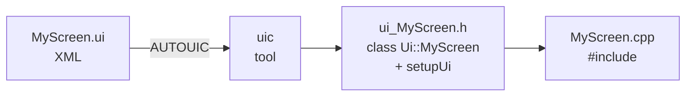

# Các tag quan trọng trong file `.ui` dùng để sinh file `.h`

> File `.ui` là **XML** mô tả cây widget. Công cụ `uic` (User Interface Compiler) đọc file này và sinh ra `ui_<Name>.h` chứa class `Ui::<Name>` với hàm `setupUi(QWidget*)`. Trong CMake bật `set(CMAKE_AUTOUIC ON)` thì việc sinh file diễn ra tự động khi build.

---

## 1. Pipeline sinh code



`ui_MyScreen.h` chứa các con trỏ `QLabel*`, `QPushButton*` … tương ứng với mỗi widget có `name=` trong `.ui`. Đó là lý do vì sao bạn truy cập được `ui->okButton` trong C++.

---

## 2. Cấu trúc tổng thể của file `.ui`

```xml
<?xml version="1.0" encoding="UTF-8"?>
<ui version="4.0">
  <class>...</class>              <!-- tên class C++ sẽ sinh ra -->
  <widget class="QWidget" name="..."> <!-- root widget -->
    <property>...</property>
    <layout>...</layout>
  </widget>
  <customwidgets>...</customwidgets>  <!-- promoted widgets -->
  <resources>...</resources>          <!-- liên kết .qrc -->
  <connections>...</connections>      <!-- signal/slot từ Designer -->
</ui>
```

---

## 3. Bảng tag quan trọng

| Tag                | Ý nghĩa                                                              | Sinh ra cái gì trong `ui_*.h`                |
| ------------------ | -------------------------------------------------------------------- | -------------------------------------------- |
| `<ui>`             | Root XML.                                                            | —                                            |
| `<class>`          | Tên class UI → `Ui::<class>`.                                        | `class Ui_<class>`, `namespace Ui {…}`       |
| `<widget>`         | Một widget (root hoặc con). `class=` là class Qt, `name=` là biến.   | Con trỏ thành viên `QXxx *name;`             |
| `<layout>`         | Layout chứa widget con (`QVBoxLayout`, `QHBoxLayout`, `QGridLayout`).| Biến layout + `addWidget`/`addLayout` calls  |
| `<item>`           | Một phần tử trong layout.                                            | Lệnh `addWidget` / `addItem`                 |
| `<property>`       | Thuộc tính (geometry, text, icon, styleSheet, ...).                  | Lệnh setter (vd `setText("...")`)            |
| `<spacer>`         | Khoảng trống co giãn (`QSpacerItem`).                                | `new QSpacerItem(...)`                       |
| `<customwidgets>`  | Khai báo widget được promote.                                        | `#include` header tương ứng                  |
| `<customwidget>`   | Một promoted widget (`<class>`, `<extends>`, `<header>`).            | —                                            |
| `<resources>`      | Liên kết file `.qrc`.                                                | `#include` resource init                     |
| `<connections>`    | Signal/slot tạo bằng Designer.                                       | Lệnh `QObject::connect(...)`                 |
| `<action>`         | `QAction` (cho menu/toolbar).                                        | Con trỏ `QAction *`                          |
| `<attribute>`      | Thuộc tính phụ của widget cha (vd tab title trong `QTabWidget`).     | Setter ngữ cảnh                              |
| `<addaction>`      | Gắn action vào menu/toolbar.                                         | `addAction(...)`                             |

---

## 4. Prototype từng tag — đủ hiểu để đọc/sửa file `.ui`

### 4.1. `<class>` và `<widget>` root — quyết định tên C++

```xml
<ui version="4.0">
  <class>StatusHeader</class>                  <!-- → namespace Ui { class StatusHeader; } -->
  <widget class="QWidget" name="StatusHeader"> <!-- root widget; name nên trùng <class> -->
    ...
  </widget>
</ui>
```

Sinh ra:

```cpp
namespace Ui { class StatusHeader: public Ui_StatusHeader {}; }
```

> ⚠️ `<class>` phải khớp với forward-declare `namespace Ui { class StatusHeader; }` bên `.h`, nếu không sẽ lỗi link.

### 4.2. `<widget>` con — sinh con trỏ thành viên

```xml
<widget class="QLabel" name="clockLabel">
  <property name="text">
    <string>14:32</string>
  </property>
</widget>
```

Sinh ra:

```cpp
QLabel *clockLabel;                   // truy cập qua ui->clockLabel
clockLabel = new QLabel(parent);
clockLabel->setObjectName("clockLabel");
clockLabel->setText(QApplication::translate(..., "14:32"));
```

### 4.3. `<layout>` + `<item>` — bố cục

```xml
<layout class="QHBoxLayout" name="headerLayout">
  <property name="spacing"><number>4</number></property>
  <item>
    <widget class="QLabel" name="dotLabel"/>
  </item>
  <item>
    <widget class="QLabel" name="onlineLabel"/>
  </item>
</layout>
```

- `class=` chọn loại layout.
- Mỗi `<item>` bọc 1 widget hoặc 1 layout/spacer con.
- `<property name="spacing">` / `leftMargin` / `topMargin`… chỉnh khoảng cách.

### 4.4. `<property>` — thuộc tính phổ biến

```xml
<property name="geometry">                     <!-- vị trí + kích thước -->
  <rect><x>0</x><y>0</y><width>240</width><height>320</height></rect>
</property>
<property name="windowTitle">
  <string>Smart Home Dashboard</string>
</property>
<property name="styleSheet">
  <string notr="true">QLabel { color: #fff; }</string>
</property>
<property name="alignment">
  <set>Qt::AlignCenter</set>
</property>
<property name="frameShape">
  <enum>QFrame::HLine</enum>
</property>
```

| Kiểu giá trị     | Cú pháp                                                 |
| ---------------- | ------------------------------------------------------- |
| chuỗi            | `<string>...</string>`                                  |
| số nguyên        | `<number>10</number>`                                   |
| bool             | `<bool>true</bool>`                                     |
| enum đơn         | `<enum>Qt::Horizontal</enum>`                           |
| set (nhiều flag) | `<set>Qt::AlignLeft\|Qt::AlignVCenter</set>`            |
| rect/size/font   | tag con riêng (`<rect>`, `<size>`, `<font>`)            |
| custom property  | thêm `stdset="0"` (vd `sizeHint`) để uic gọi `setProperty(...)` thay vì setter trực tiếp |

### 4.5. `<spacer>` — đẩy widget ra hai bên

```xml
<spacer name="titleSpacer">
  <property name="orientation"><enum>Qt::Horizontal</enum></property>
  <property name="sizeHint" stdset="0">
    <size><width>40</width><height>16</height></size>
  </property>
</spacer>
```

Sinh `QSpacerItem` đẩy phần tử kế bên về phía cuối layout.

### 4.6. `<customwidgets>` — promoted widget

```xml
<customwidgets>
  <customwidget>
    <class>StatusHeader</class>
    <extends>QWidget</extends>
    <header>ui/StatusHeader.h</header>
  </customwidget>
</customwidgets>
```

Khi đó:

```xml
<widget class="StatusHeader" name="header"/>
```

→ `ui_*.h` sẽ `#include "ui/StatusHeader.h"` và tạo `StatusHeader *header;` thay vì `QWidget *header;`.

### 4.7. `<resources>` — liên kết .qrc

```xml
<resources>
  <include location="../../resources/resources.qrc"/>
</resources>
```

Cho phép dùng đường dẫn `:/icons/wifi.svg` trong các property như `<pixmap>` hay `<iconset>`.

### 4.8. `<connections>` — signal/slot làm trong Designer

```xml
<connections>
  <connection>
    <sender>okButton</sender>
    <signal>clicked()</signal>
    <receiver>MyScreen</receiver>
    <slot>accept()</slot>
  </connection>
</connections>
```

> 💡 Trong dự án này tag `<connections/>` thường để rỗng — connect nên viết bằng tay trong `.cpp` để dễ debug và refactor.

### 4.9. `<action>` + `<addaction>` (menu/toolbar)

```xml
<action name="actionExit">
  <property name="text"><string>Exit</string></property>
</action>
<widget class="QMenu" name="menuFile">
  <addaction name="actionExit"/>
</widget>
```

Sinh `QAction *actionExit;` truy cập qua `ui->actionExit`.

---

## 5. Một file `.ui` "đầy đủ" — prototype đọc xong là làm được

```xml
<?xml version="1.0" encoding="UTF-8"?>
<ui version="4.0">
 <class>MyScreen</class>
 <widget class="QWidget" name="MyScreen">
  <property name="geometry">
   <rect><x>0</x><y>0</y><width>240</width><height>320</height></rect>
  </property>
  <layout class="QVBoxLayout" name="rootLayout">
   <item>
    <widget class="QLabel" name="titleLabel">
     <property name="text"><string>Hello</string></property>
    </widget>
   </item>
   <item>
    <widget class="StatusHeader" name="header"/>   <!-- promoted widget -->
   </item>
   <item>
    <spacer name="bottomSpacer">
     <property name="orientation"><enum>Qt::Vertical</enum></property>
    </spacer>
   </item>
   <item>
    <widget class="QPushButton" name="okButton">
     <property name="text"><string>OK</string></property>
    </widget>
   </item>
  </layout>
 </widget>
 <customwidgets>
  <customwidget>
   <class>StatusHeader</class>
   <extends>QWidget</extends>
   <header>ui/StatusHeader.h</header>
  </customwidget>
 </customwidgets>
 <resources/>
 <connections/>
</ui>
```

Sinh ra (rút gọn) `ui_MyScreen.h`:

```cpp
class Ui_MyScreen {
public:
    QVBoxLayout *rootLayout;
    QLabel      *titleLabel;
    StatusHeader *header;          // ← nhờ <customwidgets>
    QSpacerItem *bottomSpacer;
    QPushButton *okButton;

    void setupUi(QWidget *MyScreen) {
        ...
        titleLabel->setText(QApplication::translate(...,"Hello"));
        ...
    }
};
namespace Ui { class MyScreen: public Ui_MyScreen {}; }
```

---

## 6. Mẹo debug khi `.ui` không build / không hiển thị đúng

| Triệu chứng                                                  | Nguyên nhân thường gặp                                                          |
| ------------------------------------------------------------ | ------------------------------------------------------------------------------- |
| `ui_*.h: No such file or directory`                          | Quên thêm `.ui` vào `UI_FILES` hoặc thiếu `CMAKE_AUTOUIC ON`.                   |
| `error: 'okButton' was not declared`                         | `objectName` trong `.ui` không khớp tên dùng trong `.cpp`.                      |
| Promoted widget bị compile thành `QWidget`                   | Sai `<header>` trong `<customwidget>`, hoặc include path không khớp.            |
| Widget không co giãn theo cửa sổ                             | Quên đặt **layout** ở widget cha (mọi widget phải nằm trong layout).            |
| `setStyleSheet` viết trong Designer không có hiệu lực        | Property `styleSheet` chỉ áp cho widget đó; ưu tiên `QApplication::setStyleSheet` ở `main.cpp`. |
| Đổi tên `<class>` mà link lỗi                                | Phải đổi đồng bộ ở 3 chỗ: `<class>` trong `.ui`, forward-declare `namespace Ui`, và tên file `.ui`. |